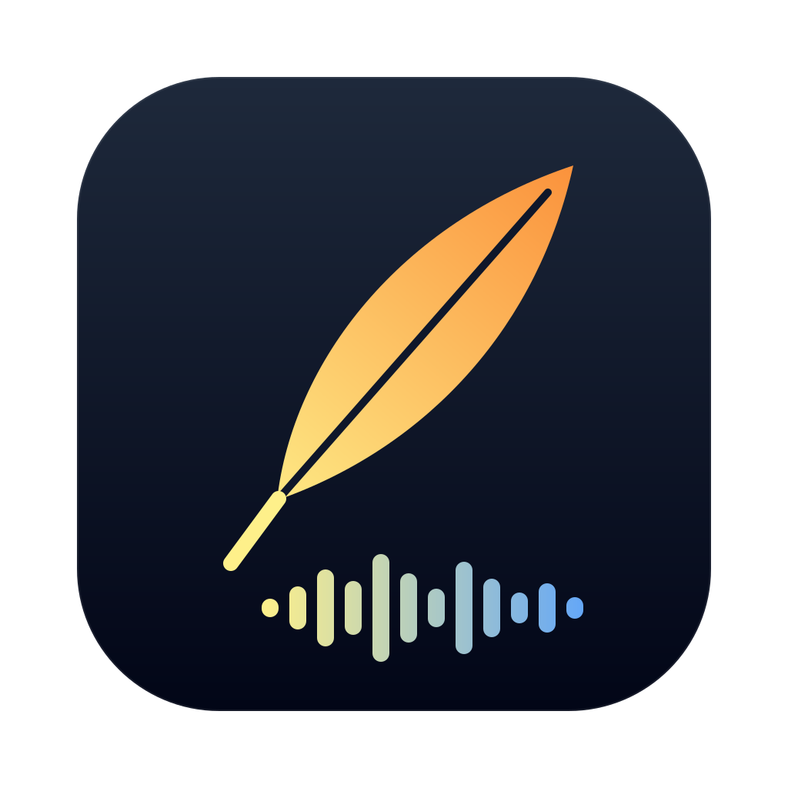
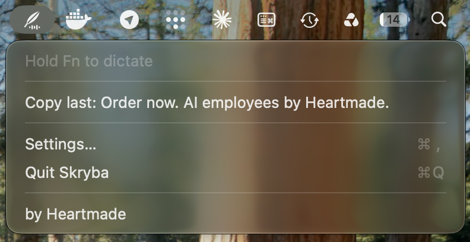
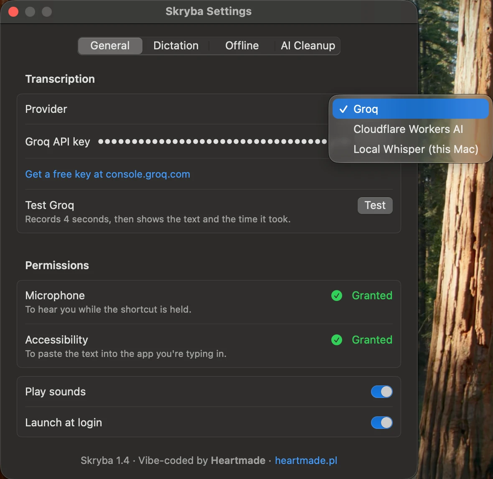
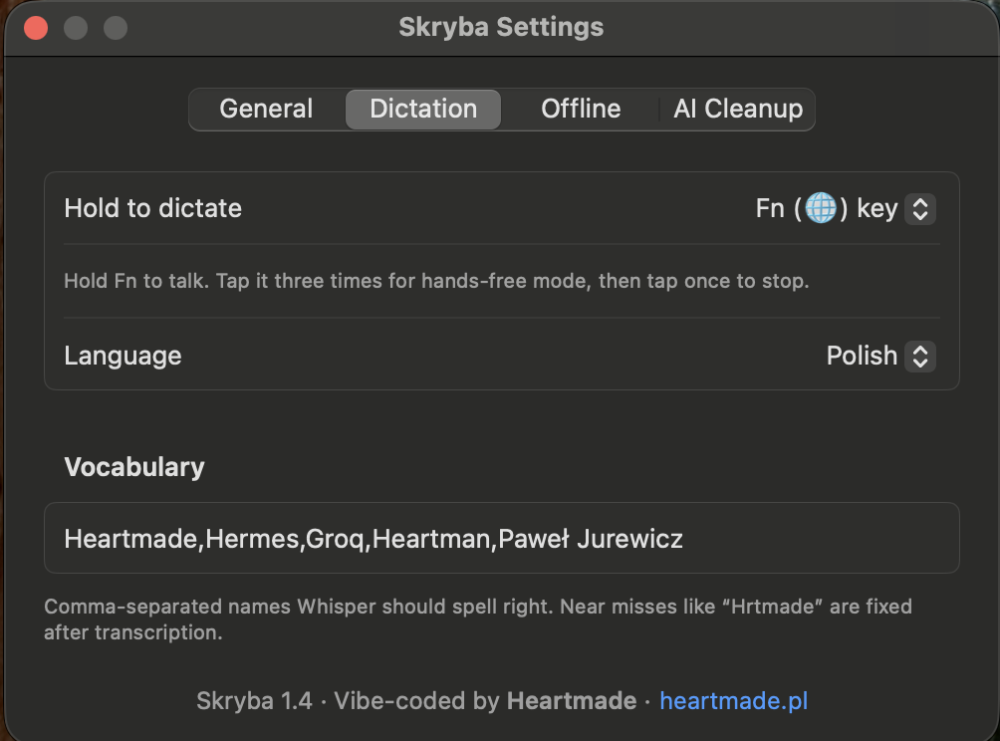
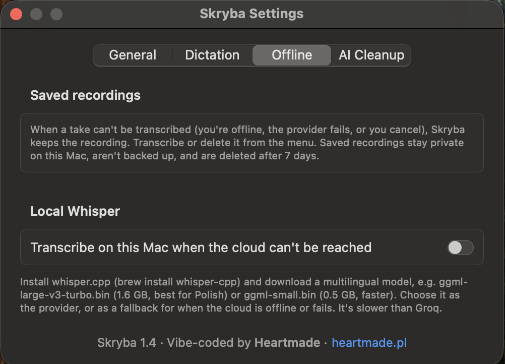
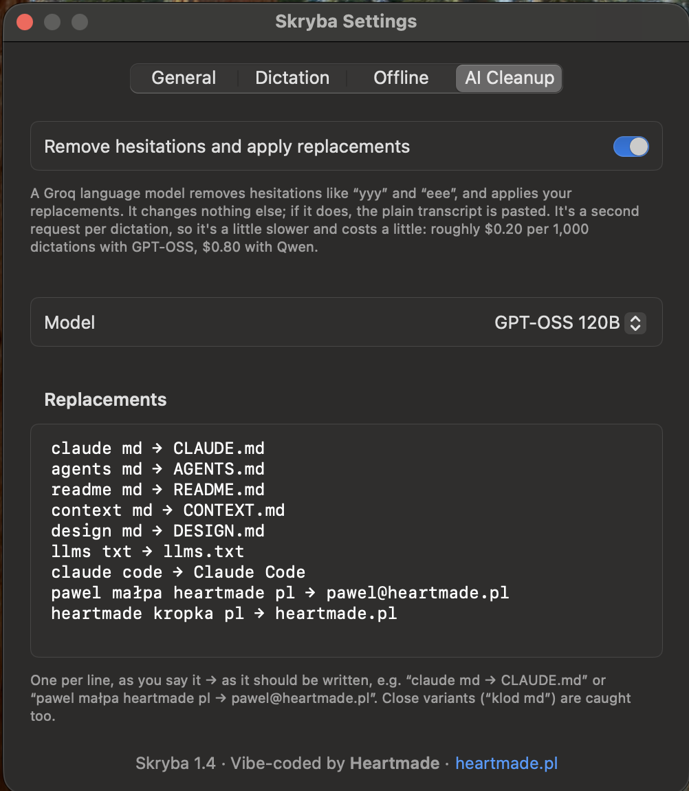

<p align="center"></p>

# Skryba

Hold **Fn**, speak, let go: your words appear as text wherever your cursor is.

Skryba (Polish for *scribe*) is a small open-source macOS menu-bar app for push-to-talk dictation.
It records while you hold the Fn (🌐) key, or a shortcut of your choice. It sends the audio to
**Whisper large-v3**, hosted by [Groq](https://groq.com) or, if you prefer, its turbo variant on
[Cloudflare Workers AI](https://developers.cloudflare.com/workers-ai/), and pastes the transcript
into the text field you were typing in. No internet? The take is kept, and you can transcribe it
later or on your Mac with [whisper.cpp](https://github.com/ggml-org/whisper.cpp).

Vibe-coded by [Heartmade](https://heartmade.pl/en/) as a readable reference app: no dependencies,
25 Swift files, about 3,400 lines including comments.

**Status: 1.6.2.** It is used daily on an Apple Silicon Mac with macOS 27. Other setups are
untested, so bug reports are welcome.

## Screenshots

It lives in the menu bar as a quill
<picture><source media="(prefers-color-scheme: dark)" srcset="docs/images/menu-bar-icon-dark.svg"></picture>.
While a recording waits to be transcribed, the quill becomes a tray.

<p align="center"></p>

| General: provider, key and Test | Dictation: trigger, language, vocabulary |
|---|---|
|  |  |
| **Offline: saved recordings and local Whisper** | **AI Cleanup: model and replacements** |
|  |  |

## How it works

```
hold Fn      ──► AVAudioRecorder (16 kHz mono AAC, temp file) + level meter
release      ──► discard if the level meter heard no voice, cut the silence after the last word
             ──► save the take to a private queue (kept until it's transcribed)
             ──► Groq (whisper-large-v3) or Cloudflare (-turbo); visible, cancellable retries
                 offline or failed? whisper.cpp on this Mac if enabled, else keep it for later
             ──► drop text Whisper invents on near-silence, fix vocabulary near misses
             ──► optional: AI cleanup of hesitations and your replacements (a chat model at the same provider)
             ──► same app, window and field in focus? clipboard ← text, ⌘V, clipboard restored
```

| File | Role |
|---|---|
| `AppController.swift` | The state machine for one take at a time: idle → recording → transcribing → pasting → idle. It also enforces the 5-minute cap and polls the key state in case a key-up is lost. |
| `FnKey.swift` | Hold-Fn trigger via NSEvent modifier monitors. Pressing any other key while Fn is down (Fn+⌫, Fn+↑) cancels the take. |
| `FnGesture.swift` | Everything a Fn press means, in one place: hold to talk, a triple tap for hands-free, a tap to stop. A cancelled take resets it, so no half-finished gesture outlives it. |
| `HotKey.swift` | Alternative custom-shortcut trigger via Carbon `RegisterEventHotKey`, which reports both press and release. |
| `AudioRecorder.swift` | Records to a private temp folder at 16 kHz mono (the rate Whisper uses internally) and meters the level. Cuts the trailing silence, where Whisper would otherwise invent words. |
| `GroqClient.swift` | Multipart upload over an ephemeral URL session (nothing cached on disk), then `verbose_json` parsing; one retry at temperature 0.2 when a segment looks garbled. |
| `CloudflareClient.swift` | Whisper large-v3-turbo through Cloudflare Workers AI, as an alternative to Groq, plus its chat models for AI cleanup. |
| `ChatCompletion.swift` | The OpenAI-style chat request that both providers accept, for AI cleanup. |
| `LocalWhisper.swift` | Optional offline transcription: converts the take to WAV with AVFoundation and runs `whisper-cli` directly (no shell). Cancelling or a timeout stops it. |
| `PendingRecordings.swift` | Takes not transcribed yet: a private folder, left out of backups, emptied after 7 days. |
| `NetworkMonitor.swift` | Knows when the Mac has no network, so the HUD says "Offline" as soon as you start. |
| `Retry.swift` | Which failures are worth another attempt (a stalled upload, a busy server) and which aren't (no network, a rejected key). |
| `TextCleanup.swift` | Optional AI cleanup: a fixed prompt, the models per provider, and a guard that pastes the raw transcript unless the reply only removed hesitations and applied your replacements. |
| `Replacements.swift` | Your rewrite rules for AI cleanup, one per line: "claude md → CLAUDE.md". |
| `Hallucinations.swift` | Drops stock phrases ("Thanks for watching") and prompt echoes, but only from clips with under 0.8 s of voice. |
| `Vocabulary.swift` | Your list of names, used as Whisper's prompt and to fix near misses afterwards ("Hrtmade" → "Heartmade"), keeping Polish case endings. |
| `PasteTarget.swift` | Remembers the app, window and text field that had focus when the take started, read through the Accessibility API. |
| `Paster.swift` | The paste step: a transient clipboard item, then ⌘V, then your clipboard restored. It refuses if the focus moved, and never overwrites something you copied meanwhile. |
| `RecordingHUD.swift` | A non-activating floating pill, so it never steals focus from the app you're typing in. |
| `Keychain.swift` | Keeps the API credentials in the macOS keychain, not in files or UserDefaults. |

## Requirements

- macOS 14 Sonoma or later. Apple Silicon is tested; Intel should work but is untested.
- A Groq API key. The free tier is enough: [console.groq.com/keys](https://console.groq.com/keys).
  Or a Cloudflare account ID and a Workers AI API token.
- Optional, for offline use: [whisper.cpp](https://github.com/ggml-org/whisper.cpp)
  (`brew install whisper-cpp`) and a multilingual model file.
- To build from source: Xcode 16 or later (for the Swift 6 toolchain)

## Download

Download [Skryba.dmg](https://github.com/heartmade-studio/skryba/releases/latest/download/Skryba.dmg)
from the [latest release](https://github.com/heartmade-studio/skryba/releases/latest), open it and
drag Skryba into Applications. It is a universal build for Apple Silicon and Intel.

Skryba is not notarized by Apple, so macOS blocks the first launch with *"Apple could not verify
Skryba is free of malware"*. If you trust this build:

1. Click **Done** in that dialog.
2. Open System Settings → Privacy & Security, scroll down to the Skryba message and click
   **Open Anyway**. Confirm with your password.
3. Click **Open Anyway** once more when macOS asks again.

When a newer version is out, Skryba says so once and puts a download link in its menu (you can
turn this check off in Settings → General). You do this once for each version you download. If you'd rather not bypass Gatekeeper for an app that asks for
Microphone and Accessibility access, read the code and build it yourself instead. Then continue with
[First launch](#first-launch).

## Build from source

```bash
git clone https://github.com/heartmade-studio/skryba.git
cd skryba
scripts/build.sh --install
```

This builds `build/Skryba.app`, copies it to `/Applications`, and launches it.

### Signing your own build (read this, or permissions reset on every rebuild)

macOS ties Microphone, Accessibility and keychain access to an app's code signature. If there is
no signing identity, the build script signs *ad hoc*. An ad-hoc signature changes with every
build, so macOS treats each build as a new app: you re-grant permissions and see keychain prompts
every time.

The fix is free and takes a minute. Open **Xcode → Settings → Accounts**, add your Apple ID, then
click **Manage Certificates… → + → Apple Development**. `build.sh` picks up that identity
automatically. It signs the app with a designated requirement based on the signed app identifier
and your certificate's Team ID, so renewing an Apple Development certificate in the same team does
not change the app identity macOS uses for privacy grants.

If the certificate shows up in Xcode but `build.sh` still signs ad hoc, your keychain is missing
Apple's intermediate certificate. Download
[AppleWWDRCAG3.cer](https://www.apple.com/certificateauthority/AppleWWDRCAG3.cer), double-click it,
and rebuild. `security find-identity -v -p codesigning` should then list your identity. To use a
different identity:

```bash
SKRYBA_SIGN_IDENTITY="Your Identity Name" scripts/build.sh
```

## First launch

Settings opens. Paste your Groq key (or pick Cloudflare, or local Whisper), click **Save**, check it
with **Test**, and grant two permissions:

- **Microphone**, to record while you hold the trigger.
- **Accessibility**, to see the Fn key while other apps are in front and to send ⌘V. Without it,
  the Fn trigger won't work in other apps. A custom shortcut still works, but the text is only left
  on your clipboard.

## Usage

- **Hold Fn**, speak, and **release**. Taps shorter than 0.3 s and takes with no voice are ignored.
  One take can last up to 5 minutes.
- **Hands-free:** tap Fn three times quickly (within a second) and keep talking without holding
  anything. Hands-free starts when you let go of the third tap, so two taps and then a hold are
  ordinary push-to-talk. The HUD says *Hands-free · tap Fn to stop*. Tap Fn once to stop and transcribe, or use
  **Cancel recording** in the menu to discard. The 5-minute cap still applies. Hands-free works with
  the Fn trigger only.
- If macOS Dictation is on with its shortcut set to *Press 🌐 twice* (System Settings → Keyboard →
  Dictation), a triple tap starts both dictations. Pick another shortcut for macOS Dictation or
  turn it off.
- For Fn to be free, set **System Settings → Keyboard → Press 🌐 key to → Do Nothing**. Skryba
  warns you in Settings until you do.
- Many third-party keyboards don't send Fn to macOS. In that case, switch **Hold to dictate** to a
  custom shortcut (default ⌃⇧Space). A custom shortcut needs at least one modifier (F-keys may go
  without). macOS 15+ refuses global hotkeys whose only modifiers are ⌥ or ⌥⇧.
- The text is pasted only where you started: the same app, window and text field. If you switch
  apps, windows, browser tabs or chats while it transcribes, the text goes to your clipboard
  instead. If you copy something in that moment, your copy is left alone and the transcript is only
  under **Copy last** in the menu. Some Electron apps don't report their focused field. There,
  only a change of app is detected, so a chat switch inside one app is not.
- **Vocabulary** is a comma-separated list of names and jargon. Whisper treats its prompt as "text
  that came before", so on its own the list is only a soft hint. Skryba therefore also corrects
  near misses after transcription, for terms of five letters or more. It allows one wrong letter,
  or two for terms of eight letters or more. Put every name you dictate here, including the ones
  on your AI cleanup replacement list: replacements never reach Whisper, so "CLAUDE.md" only in
  the replacements can come back as ".md", while in the vocabulary it comes back right.
- **Language:** setting it explicitly (rather than *Auto-detect*) improves accuracy on short clips.
- **Offline or a bad connection:** see [No internet](#no-internet) below.
- Silence detection is a level meter, not speech recognition. Loud background noise can pass it,
  and very quiet speech might not. The measured levels are logged (see Troubleshooting).

## Privacy

Skryba has no servers, accounts, analytics or telemetry. It talks to the provider you chose:
`api.groq.com` or `api.cloudflare.com`, and once a day to `api.github.com` to check for updates.

- **What leaves your Mac:** the audio of each take, plus your vocabulary list (sent as Whisper's
  prompt), to that one provider. With AI cleanup on, the transcript and your replacements also go
  to a chat model at that same provider. If you put client names in the vocabulary,
  the provider receives them with every request. Read
  [Groq's privacy policy](https://groq.com/privacy-policy/) or Cloudflare's if that matters for
  your use. Local Whisper sends nothing anywhere.
- **What stays local:** your settings and vocabulary (in UserDefaults), the API key (in the
  keychain), and the last transcript (in memory only, shown under *Copy last*).
- **Recordings** are kept in `~/Library/Application Support/Skryba/Pending` (readable only by you,
  left out of Time Machine) until they are transcribed. A take that couldn't be transcribed stays
  there until you transcribe or delete it from the menu, and for at most 7 days. Deleting a file on
  an SSD is not a secure erase.
- **Update check:** once a day Skryba asks GitHub for its latest release, a request that carries
  nothing about you or your dictations beyond what any web request does (your IP address). A newer
  version shows up as a download link in the menu; nothing is downloaded or installed by itself.
  Turn it off in Settings → General.
- **Network:** an ephemeral URL session, so no cookies or HTTP cache are written to disk.
- **Microphone:** it is on only during a take, and macOS shows its orange dot while it is.
- **Accessibility** is a broad permission. Skryba uses it to notice the Fn key, to check which
  window and field have focus, and to send ⌘V. It never reads the content of your fields, and never
  stores or sends the keys you press.
- **Clipboard:** the paste goes through the clipboard as an item marked *transient*, so clipboard
  managers that honour the convention skip it. It's a convention, not a security boundary. When
  pasting isn't possible, the text stays on your clipboard as a normal item.
- The **by Heartmade** links open heartmade.pl with a `utm_source=skryba` tag, and only when you
  click them.

## No internet

Skryba never throws a dictation away because the network is gone.

- **Offline when you start:** the HUD says *Offline · will be saved for later* (or *will transcribe
  on this Mac*) while you speak. Recording works as usual.
- **A bad connection:** all attempts share one deadline: 12 seconds for a short take, a little more
  for a long one (12 s + 10% of its length). A hanging request is cut off at half of it, so there's
  time for a retry. The HUD shows each attempt with a **Cancel** button; **Cancel transcription** in
  the menu does the same. No network at all, or a rejected key, isn't retried. AI cleanup gets 30
  seconds plus a little per word, then the plain transcript is pasted; **Skip** pastes it at once.
- **What happens to the take:** if it can't be transcribed, or you cancel, it's saved. The menu-bar
  icon turns into a tray, and the menu lists saved recordings. **Transcribe and copy** puts the
  text on your clipboard (it isn't pasted: the field you dictated into is long gone). When the
  network comes back, a short notice reminds you. Nothing is sent by itself.
- **Local Whisper (optional):** install whisper.cpp (`brew install whisper-cpp`), download a
  multilingual model from [Hugging Face](https://huggingface.co/ggerganov/whisper.cpp/tree/main),
  for example `ggml-large-v3-turbo.bin` (1.6 GB, best for Polish) or `ggml-small.bin` (0.5 GB,
  faster), and choose it in Settings → Offline. Then either pick **Local Whisper** as the provider
  (audio never leaves your Mac), or keep Groq or Cloudflare and turn local Whisper on as the
  fallback for when the cloud is offline or fails. **Test** in Settings records a few seconds and
  shows the text and how long it took. AI cleanup is skipped while offline.

## AI cleanup (optional, off by default)

Whisper transcribes what it hears, including "yyy" and "eee". Turn on **Settings → AI cleanup** to
pass each transcript through a chat model at the provider that transcribes, so the text goes
nowhere the audio didn't:

- **Groq:** `openai/gpt-oss-120b` by default, or `qwen/qwen3.8-27b` (preview).
- **Cloudflare:** `@cf/openai/gpt-oss-120b` by default, `@cf/google/gemma-4-26b-a4b-it` or
  `@cf/mistralai/mistral-small-3.1-24b-instruct`.
- **Local Whisper:** no cleanup. Nothing leaves your Mac.

Each provider remembers its own choice. Every model that can reason does so before answering
(Mistral can't): in tests, GPT-OSS on its lowest setting missed misspelled replacements like
"klod md". Quality comes before speed here. Cleanup does two things only:

- **Removes hesitations** such as "yyy", "eee", "hmm".
- **Applies your replacements.** One rule per line in **Replacements**, as you say it → as it should
  be written: `claude md → CLAUDE.md`, `pawel małpa heartmade pl → pawel@heartmade.pl`. The model
  also catches close variants that Whisper spelled differently ("klod md").

Everything else stays as Whisper wrote it: no rewording, no fixed words, no removed filler words
like "no" or "tego".

- **It's a second request**, so dictation takes longer: about 1–2 s on Groq, 7 s with GPT-OSS
  and 15 s with Gemma on Cloudflare (short dictations, September 2026). The HUD shows
  *Cleaning up…* with a **Skip** button that pastes the plain transcript, and request timings are
  logged (see Troubleshooting).
- **It can't lose your dictation.** A language model may answer a dictated question, reword it or
  drop a word. Skryba compares the reply with the transcript word by word, ignoring punctuation and
  case. Unless the only differences are removed hesitations and replacements that sound like one of
  your rules, it pastes the plain transcript, with a note in the HUD. It does the same if the
  request fails.
- **Compare with the original:** after a cleaned-up dictation, **Copy without AI cleanup** in the
  menu gives you the plain transcript. Like *Copy last*, it's kept in memory only.

## Cost

Groq bills whisper-large-v3 at $0.111 per hour of audio, with a 10-second minimum per request
(pricing as of October 2026, so check Groq's site). One thousand short dictations come to about
$0.31. Skryba used the cheaper turbo model ($0.04 per hour) until 1.6; the full one hears names and
English terms in Polish speech better.

Cloudflare has only the turbo model, at $0.000513 per audio minute ($0.03 per hour), and its Workers
free allocation covers light use. Local Whisper costs nothing but your Mac's time.

AI cleanup adds token costs. On Groq: $0.15/$0.60 per million input/output tokens for GPT-OSS
120B, and $0.80/$4.00 for Qwen 3.8 27B. A short dictation is at most about 450 tokens in and 200
out, plus up to about 500 tokens of reasoning, which comes to about $0.40 per 1,000 dictations
with GPT-OSS and $0.80 with Qwen.

On Cloudflare, a short dictation used about 40 neurons with GPT-OSS, 20 with Gemma and 10 with
Mistral (September 2026), so the free 10,000 neurons a day cover roughly 250, 500 and 1,000
dictations. Long dictations and a long replacement list use more. These are estimates; your Groq or
Cloudflare dashboard shows the real numbers.

## Troubleshooting

- **Nothing pastes, or the Accessibility toggle is on but has no effect.** This usually means an
  old grant belongs to a previous build's signature. In Settings → Permissions, open Accessibility
  Settings, remove Skryba with the **−** button, then grant it again. With an Apple Development
  identity, rebuilds signed by the same Team ID should retain the grant; ad-hoc builds still reset it.
- **"Shortcut is already taken."** Another app registered it. Pick a different one.
- **The text comes out in the wrong language.** Set the language explicitly in Settings.
- **Takes are discarded as "No speech detected", or noise gets through.** Watch the logged levels
  and request timings, then open an issue with a few lines:
  ```bash
  log stream --predicate 'subsystem == "pl.heartmade.skryba"' --level info
  ```

## Uninstall

1. In Skryba's Settings, turn off **Launch at login**, clear the API key and click **Save**. Then
   quit Skryba.
2. Delete `/Applications/Skryba.app`.
3. Remove its preferences and caches:
   ```bash
   defaults delete pl.heartmade.skryba
   rm -rf ~/Library/Caches/pl.heartmade.skryba ~/Library/HTTPStorages/pl.heartmade.skryba
   ```
4. Revoke its permissions: in System Settings → Privacy & Security, select Skryba under
   **Microphone** and **Accessibility** and click **−**.

If you skipped step 1, remove the keys with
`security delete-generic-password -s pl.heartmade.skryba` (run it once per key), and saved
recordings with `rm -rf ~/Library/Application\ Support/Skryba`.

## Development

```bash
swift build          # compile (Swift 6 language mode)
swift test           # unit tests (Swift Testing)
scripts/build.sh     # assemble and sign build/Skryba.app
scripts/make-icon.sh # regenerate the icons after editing Resources/*.svg
```

You can open `Package.swift` in Xcode to edit the code. Run through `scripts/build.sh` rather than
Xcode's Run button, because the app needs its `Info.plist` (microphone usage string, `LSUIElement`)
inside a real `.app` bundle.

Automated tests cover the pure logic: vocabulary correction, the hallucination filter, the retry
rules and the saved-recordings queue. With whisper.cpp installed, one more test runs a real
transcription: `SKRYBA_WHISPER_MODEL=/path/to/ggml-….bin swift test`. The
parts that touch the microphone, keyboard and clipboard are checked by hand with
[docs/manual-tests.md](docs/manual-tests.md). Run through it before a release.

Each release gets a universal, unnotarized `Skryba.dmg` attached. To build it (needs full Xcode for
the second architecture):

```bash
scripts/build.sh
export DEVELOPER_DIR=/Applications/Xcode.app/Contents/Developer
BIN="$(swift build -c release --arch arm64 --arch x86_64 --show-bin-path)"
swift build -c release --arch arm64 --arch x86_64
cp "$BIN/Skryba" build/Skryba.app/Contents/MacOS/
lipo -archs build/Skryba.app/Contents/MacOS/Skryba   # expect: x86_64 arm64
codesign --force --sign "Apple Development" build/Skryba.app
rm -rf build/dmg && mkdir build/dmg && cp -R build/Skryba.app build/dmg/
ln -s /Applications build/dmg/Applications
cp Resources/AppIcon.icns build/dmg/.VolumeIcon.icns
# The volume's custom-icon flag only survives if set on the mounted image, so go through a
# writable copy first.
hdiutil create -volname "Skryba" -srcfolder build/dmg -format UDRW -ov build/Skryba-rw.dmg
mkdir -p build/mnt && hdiutil attach build/Skryba-rw.dmg -nobrowse -mountpoint build/mnt
SetFile -a C build/mnt
rm -rf build/mnt/.fseventsd
hdiutil detach build/mnt
hdiutil convert build/Skryba-rw.dmg -format UDZO -ov -o build/Skryba.dmg
rm build/Skryba-rw.dmg
```

Found a security issue? See [SECURITY.md](SECURITY.md).

## License

MIT, see [LICENSE](LICENSE).
